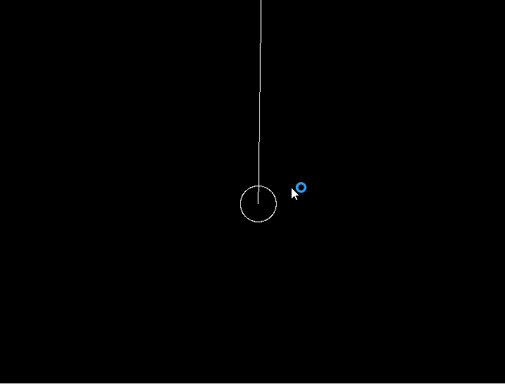

# Pendulum Simulation

Built with SFML, followed the book "The Nature Of Code - Daniel Shiffman".

By using angular velocity, angular acceleration, and friction, we can simulate the motion of a Pendulm.

Project was made in 10/1/2023.
